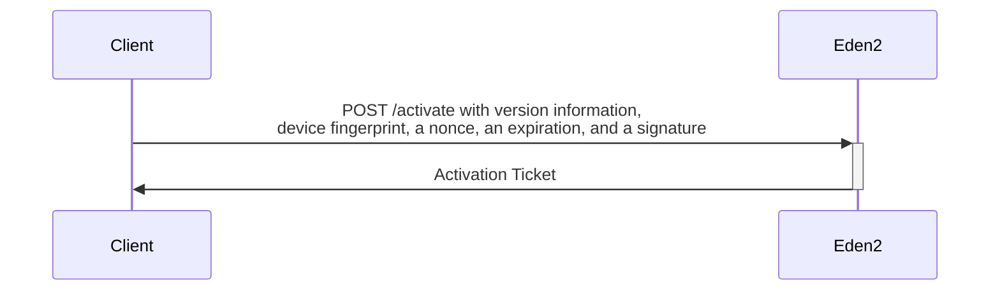

# Adobe ADEPT protocol documentation

## High-Level Overview
The ADEPT protocol consists of three main parts:
1. [Sign In](signin.md)
2. Activation
3. Fulfillment

### Activation

```mermaid
%%{init: { 'sequence': { 'actorMargin': 300 } }}%%
sequenceDiagram
  participant C as Client
  participant E as Eden2
  
  C ->>+ E: POST /activate with version information,<br/> device fingerprint, a nonce, an expiration, and a signature
  E ->>- C: Activation Ticket
```
