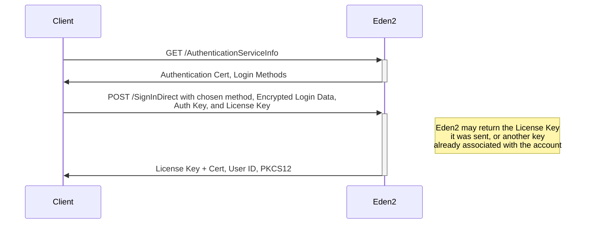
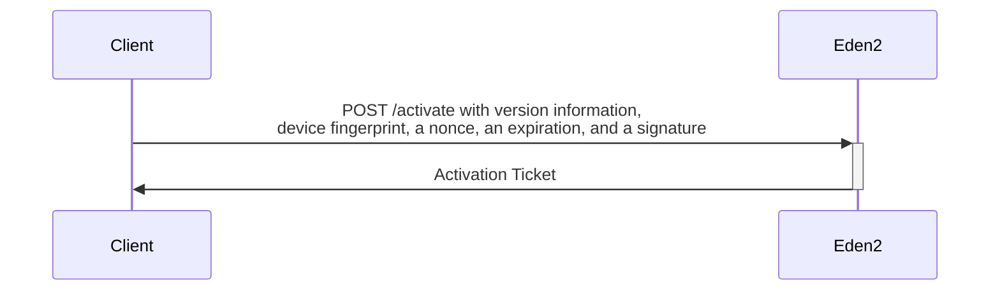

# Adobe ADEPT protocol documentation

## High-Level Overview
The ADEPT protocol consists of three main parts:
1. Sign in
2. Activation
3. Fulfillment

### Sign In

```mermaid
%%{init: { 'sequence': { 'actorMargin': 200 } }}%%
sequenceDiagram
  participant C as Client
  participant E as Eden2
  
  C ->>+ E: GET /AuthenticationServiceInfo
  E ->>- C: Authentication Cert, Login Methods
  
  C ->>+ E: POST /SignInDirect with chosen method, Encrypted Login Data,<br/> Auth Key, and License Key
  note right of E: Eden2 may return the License Key <br/> it was sent, or another key<br/> already associated with the account
  E ->>- C: License Key + Cert, User ID, PKCS12
```

### Activation

```mermaid
%%{init: { 'sequence': { 'actorMargin': 300 } }}%%
sequenceDiagram
  participant C as Client
  participant E as Eden2
  
  C ->>+ E: POST /activate with version information,<br/> device fingerprint, a nonce, an expiration, and a signature
  E ->>- C: Activation Ticket
```
