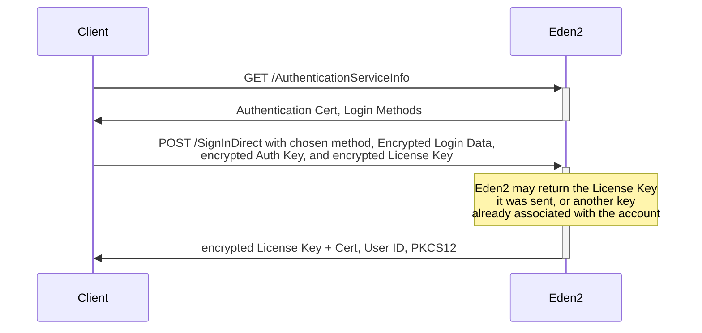

# Sign In
## Diagram

```mermaid
%%{init: { 'sequence': { 'actorMargin': 200 } }}%%
sequenceDiagram
  participant C as Client
  participant E as Eden2
  
  C ->>+ E: GET /AuthenticationServiceInfo
  E ->>- C: Authentication Cert, Login Methods
  
  C ->>+ E: POST /SignInDirect with chosen method, Encrypted Login Data,<br/> encrypted Auth Key, and encrypted License Key
  note over E: Eden2 may return the License Key <br/> it was sent, or another key<br/> already associated with the account
  E ->>- C: encrypted License Key + Cert, User ID, PKCS12
```
