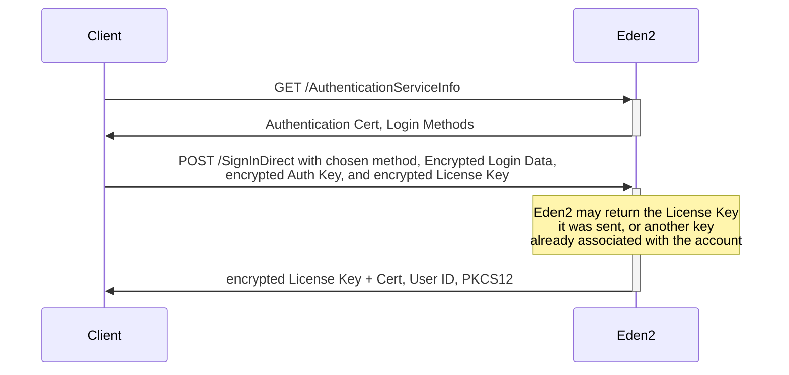

# Sign In
## Diagram


#### Login Methods
Eden2 will return several supported authentication methods. It MUST return at least `AdobeID` and `anonymous`.
The method will have both a human-readable name (i.e. "Adobe ID") and an ID (i.e. `AdobeID`). The `NodeID` and `type` can safely be ignored.

#### Authentication Cert
The authentication cert should always be:
```
MIIEYDCCA0igAwIBAgIER2q5eTANBgkqhkiG9w0BAQUFADCBhDELMAkGA1UEBhMCVVMxIzAhBgNVBAoTGkFkb2JlIFN5c3RlbXMgSW5jb3Jwb3JhdGVkMRswGQYDVQQLExJEaWdpdGFsIFB1Ymxpc2hpbmcxMzAxBgNVBAMTKkFkb2JlIENvbnRlbnQgU2VydmVyIENlcnRpZmljYXRlIEF1dGhvcml0eTAeFw0wODAxMDkxODQzNDNaFw0xODAxMzEwODAwMDBaMHwxKzApBgNVBAMTImh0dHA6Ly9hZGVhY3RpdmF0ZS5hZG9iZS5jb20vYWRlcHQxGzAZBgNVBAsTEkRpZ2l0YWwgUHVibGlzaGluZzEjMCEGA1UEChMaQWRvYmUgU3lzdGVtcyBJbmNvcnBvcmF0ZWQxCzAJBgNVBAYTAlVTMIGfMA0GCSqGSIb3DQEBAQUAA4GNADCBiQKBgQDZAxpzOZ7N38ZGlQjfMY/lfu4Ta4xK3FRm069VwdqGZIwrfTTRxnLE4A9i1X00BnNk/5z7C0pQX435ylIEQPxIFBKTH+ip5rfDNh/Iu6cIlB0N4I/t7Pac8cIDwbc9HxcGTvXg3BFqPjaGVbmVZmoUtSVOsphdA43sZc6j1iFfOQIDAQABo4IBYzCCAV8wEgYDVR0TAQH/BAgwBgEB/wIBATAUBgNVHSUEDTALBgkqhkiG9y8CAQUwgbIGA1UdIASBqjCBpzCBpAYJKoZIhvcvAQIDMIGWMIGTBggrBgEFBQcCAjCBhhqBg1lvdSBhcmUgbm90IHBlcm1pdHRlZCB0byB1c2UgdGhpcyBMaWNlbnNlIENlcnRpZmljYXRlIGV4Y2VwdCBhcyBwZXJtaXR0ZWQgYnkgdGhlIGxpY2Vuc2UgYWdyZWVtZW50IGFjY29tcGFueWluZyB0aGUgQWRvYmUgc29mdHdhcmUuMDEGA1UdHwQqMCgwJqAkoCKGIGh0dHA6Ly9jcmwuYWRvYmUuY29tL2Fkb2JlQ1MuY3JsMAsGA1UdDwQEAwIBBjAfBgNVHSMEGDAWgBSL7vCBYMmi2h4OUsFYDASwQ/eP6DAdBgNVHQ4EFgQU9RP19K+lzF03he+0T47hCVkPhdAwDQYJKoZIhvcNAQEFBQADggEBAJoqOj+bUa+bDYyOSljs6SVzWH2BN2ylIeZKpTQYEo7jA62tRqW/rBZcNIgCudFvEYa7vH8lHhvQak1s95g+NaNidb5tpgbS8Q7/XTyEGS/4Q2HYWHD/8ydKFROGbMhfxpdJgkgn21mb7dbsfq5AZVGS3M4PP1xrMDYm50+Sip9QIm1RJuSaKivDa/piA5p8/cv6w44YBefLzGUN674Y7WS5u656MjdyJsN/7Oup+12fHGiye5QS5mToujGd6LpU80gfhNxhrphASiEBYQ/BUhWjHkSi0j4WOiGvGpT1Xvntcj0rf6XV6lNrOddOYUL+KdC1uDIe8PUI+naKI+nWgrs=
```

### Keys
#### Device Key
The device key is a Base64 encoded string containing a random 16 bytes.
#### Auth Key
This is a randomly generated 1024-bit RSA key.
It's private key should in PKCS8 format, and be encrypted with the Device Key.
#### License Key
The license key is another RSA key, generated in an identical manner to the Auth Key.
Eden2 may return a different key then you send it, this will be the License Key already associated with the account.
Replace the random License Key with the one returned by Eden2.

### Encrypted Login Data
Login Data is a simple byte array in this form:
```
Device Key (Base64 decoded) + len(Username) + Username + len(Password) + Password
```
It should then be encrypted with the Authentication Cert
